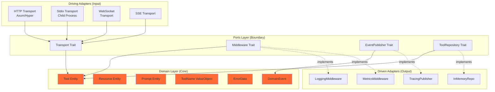
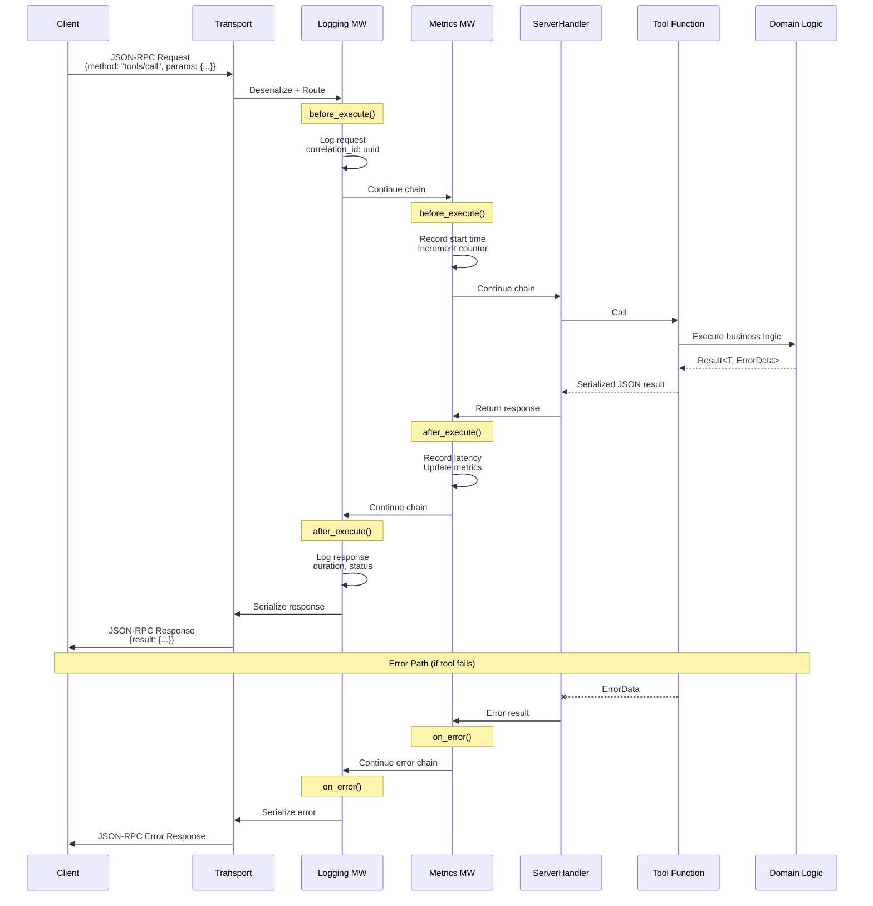
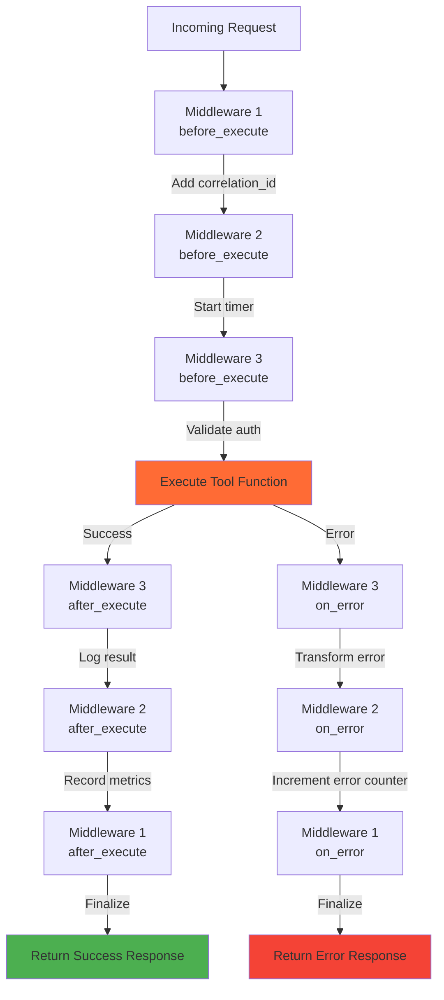
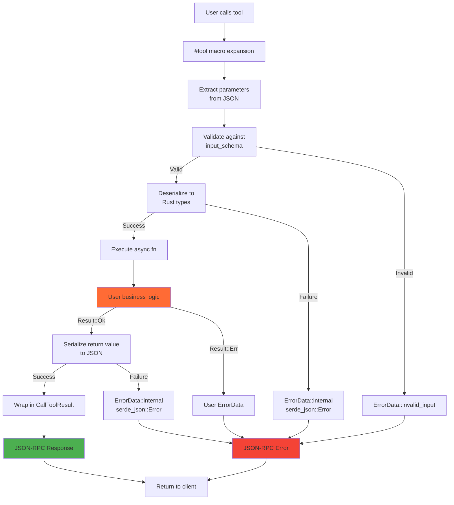
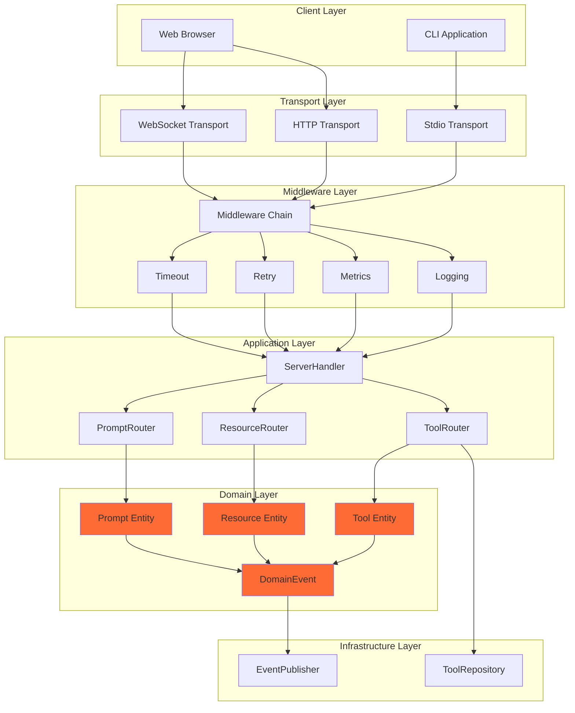

# Architecture Overview

Vulcan is built on **Domain-Driven Design (DDD)** and **Hexagonal Architecture** principles for maintainability, testability, and flexibility.

## The Three Layers

```
┌──────────────────────────────────────────────────┐
│                  ADAPTERS LAYER                   │
│         (Infrastructure - How it works)           │
│                                                   │
│  • LoggingMiddleware     • MetricsMiddleware     │
│  • TracingEventPublisher • InMemoryToolRepository│
│  • TimeoutMiddleware     • RetryMiddleware       │
└─────────────────┬────────────────────────────────┘
                  │  Implements
                  ▼
┌──────────────────────────────────────────────────┐
│                   PORTS LAYER                     │
│         (Interfaces - What we need)               │
│                                                   │
│  • Middleware trait     • EventPublisher trait    │
│  • ToolRepository trait • Transport trait         │
└─────────────────┬────────────────────────────────┘
                  │  Uses
                  ▼
┌──────────────────────────────────────────────────┐
│                   DOMAIN LAYER                    │
│         (Business Logic - What we do)             │
│                                                   │
│  • Tool          • DomainEvent                    │
│  • ToolName      • ErrorData                      │
│  • Resource      • Prompt                         │
└──────────────────────────────────────────────────┘
```

<CardGroup cols={3}>
  <Card title="Domain Layer" icon="cube">
    Pure business logic, no dependencies
  </Card>
  <Card title="Ports Layer" icon="plug">
    Trait definitions, contracts
  </Card>
  <Card title="Adapters Layer" icon="cubes">
    Concrete implementations
  </Card>
</CardGroup>

## The Dependency Rule

**Dependencies point inward:**

```
Adapters → Ports → Domain
```

The domain never depends on outer layers. This means:
- Domain has **zero** infrastructure code
- Ports define **what** the domain needs
- Adapters provide **how** it works

<Tip>
This architecture allows you to swap adapters (e.g., InMemory → Postgres) without changing domain logic!
</Tip>

## Why This Architecture?

<AccordionGroup>
  <Accordion title="Testability">
    Test domain logic without infrastructure:

    ```rust
    // Unit test: No database, no HTTP, pure logic
    #[test]
    fn test_tool_validation() {
        let tool = Tool::new("test", "desc", schema)?;
        assert_eq!(tool.name().as_str(), "test");
    }
    ```

    Test with mock adapters:

    ```rust
    // Integration test: Mock adapters
    let mock_repo = MockToolRepository::new();
    let service = MyService::new(mock_repo);
    ```
  </Accordion>

  <Accordion title="Flexibility">
    Swap implementations easily:

    ```rust
    // Development: Fast in-memory
    let repo = InMemoryToolRepository::new();

    // Production: Persistent database
    let repo = PostgresToolRepository::new(pool);

    // Testing: Controlled mock
    let repo = MockToolRepository::new();

    // All implement the same ToolRepository trait!
    ```
  </Accordion>

  <Accordion title="Maintainability">
    Clear separation of concerns:

    - Domain: Business rules
    - Ports: Contracts
    - Adapters: Infrastructure

    Change infrastructure without touching business logic.
  </Accordion>

  <Accordion title="Independence">
    Domain is framework-agnostic:

    ```rust
    // Domain code has NO imports from:
    // - tokio, axum, reqwest (infrastructure)
    // - Database libraries
    // - HTTP clients

    // Only imports:
    use serde::{Serialize, Deserialize};  // Data only
    use thiserror::Error;  // Errors only
    ```
  </Accordion>
</AccordionGroup>

## Code Organization

```
crates/vulcan/src/
├── domain/              # Business logic (inner)
│   ├── entities/        # Tool, Resource, Prompt
│   ├── value_objects/   # ToolName, ResourceUri
│   ├── services/        # ToolExecutor trait
│   └── events.rs        # DomainEvent enum
│
├── ports/               # Trait definitions (boundary)
│   ├── middleware.rs    # Middleware trait
│   ├── events.rs        # EventPublisher trait
│   ├── repository.rs    # ToolRepository trait
│   └── mod.rs           # Transport trait
│
├── adapters/            # Implementations (outer)
│   ├── middleware.rs    # Logging, Metrics, etc.
│   ├── events.rs        # TracingEventPublisher
│   └── repository.rs    # InMemoryToolRepository
│
├── handler/             # Application layer
│   ├── server.rs        # ServerHandler
│   └── client.rs        # ClientHandler
│
└── transport/           # Transport implementations
    ├── async_rw.rs      # Stdio transport
    ├── sse_*.rs         # SSE transport
    └── streamable_http_*.rs  # HTTP transport
```

## Design Principles

### 1. Domain-Driven Design (DDD)

Focus on the business domain:

```rust
// Domain entity: Represents a business concept
pub struct Tool {
    name: ToolName,           // Value object
    description: String,
    input_schema: Value,
}

impl Tool {
    // Domain behavior
    pub fn validate_params(&self, params: &Value) -> Result<(), ErrorData> {
        // Business rule: Validate against schema
    }
}
```

### 2. Hexagonal Architecture

Keep domain independent - the hexagon shape represents the domain at the center, with ports as the boundary:



**Key insight:** Domain (orange) has zero dependencies on outer layers. All dependencies point inward!

### 3. Ports and Adapters

Ports define contracts, adapters implement them:

```rust
// Port (trait): What the domain needs
#[async_trait]
pub trait EventPublisher: Send + Sync {
    async fn publish(&self, event: DomainEvent) -> Result<(), ErrorData>;
}

// Adapter (impl): How we do it
pub struct TracingEventPublisher;

#[async_trait]
impl EventPublisher for TracingEventPublisher {
    async fn publish(&self, event: DomainEvent) -> Result<(), ErrorData> {
        tracing::info!(?event, "Event published");
        Ok(())
    }
}
```

## Request Flow Lifecycle

Complete lifecycle of an MCP request from client to server and back:



<Tip>
**Notice:** Middleware wraps the request in both directions - `before_execute` on the way in, `after_execute` on the way out. This enables powerful cross-cutting concerns like logging, metrics, and tracing.
</Tip>

## Middleware Chain Processing

How multiple middleware compose to process a single request:



**Middleware Context** flows through the entire chain:
```rust
pub struct MiddlewareContext {
    pub correlation_id: String,        // Unique request ID
    pub metadata: HashMap<String, String>,  // Shared state
    pub start_time: Option<Instant>,   // For latency tracking
}
```

## Tool Execution Flow

Detailed flow of how a tool is executed with macro expansion:



**Example macro expansion:**
```rust
// What you write:
#[tool(description = "Add numbers")]
async fn add(&self, a: i32, b: i32) -> Result<i32, ErrorData> {
    Ok(a + b)
}

// What the macro generates (simplified):
async fn add_impl(&self, params: serde_json::Value) -> Result<CallToolResult, ErrorData> {
    // 1. Validate against schema
    validate_schema(&params, &self.add_schema())?;

    // 2. Deserialize parameters
    let a: i32 = params["a"].as_i64().ok_or(ErrorData::invalid_input("a"))? as i32;
    let b: i32 = params["b"].as_i64().ok_or(ErrorData::invalid_input("b"))? as i32;

    // 3. Call user function
    let result = self.add(a, b).await?;

    // 4. Serialize result
    let json = serde_json::to_value(result)?;

    // 5. Wrap in response
    Ok(CallToolResult {
        content: vec![Content::text(json.to_string())],
        is_error: false,
        ..Default::default()
    })
}
```

## Component Interaction Diagram

How all major components interact in a running system:



## Key Benefits

| Benefit | Without Architecture | With Architecture |
|---------|---------------------|-------------------|
| **Testing** | Mock entire infrastructure | Mock only adapters |
| **Changes** | Ripple through codebase | Isolated to layers |
| **Understanding** | Mixed concerns | Clear boundaries |
| **Reusability** | Tightly coupled | Loosely coupled |

## Traffic-Light Development

Vulcan was built using Traffic-Light methodology:

<Steps>
  <Step title="🔴 RED - Tests First">
    Write tests that demonstrate requirements
    ```rust
    #[test]
    fn test_tool_registration() {
        // Test fails - feature doesn't exist yet
    }
    ```
  </Step>

  <Step title="🟡 YELLOW - Make It Work">
    Minimal implementation to pass tests
    ```rust
    impl ToolRepository {
        fn register(&mut self, tool: Tool) {
            self.tools.insert(tool.name(), tool);
        }
    }
    ```
  </Step>

  <Step title="🟢 GREEN - Make It Right">
    Refactor, add error handling, documentation
    ```rust
    impl ToolRepository {
        /// Registers a tool in the repository
        fn register(&mut self, tool: Tool) -> Result<(), ErrorData> {
            if self.tools.contains_key(tool.name()) {
                return Err(ErrorData::invalid_input("Tool already exists"));
            }
            self.tools.insert(tool.name(), tool);
            Ok(())
        }
    }
    ```
  </Step>
</Steps>

## Integration-First Testing

All tests use real implementations:

```rust
// ✅ Real transport, real middleware
#[tokio::test]
async fn test_server_with_middleware() {
    let (client_transport, server_transport) = duplex();  // Real transport

    let mut chain = MiddlewareChain::new();
    chain.add(Arc::new(LoggingMiddleware::new()));  // Real middleware

    let server = MyServer::new();
    server.serve_with_middleware(server_transport, chain).await?;
}

// ❌ NO mocks in Vulcan's test suite
```

## Evolution

Vulcan evolved through 6 phases:

1. **Phase 1**: Domain Layer - Entities, value objects
2. **Phase 2**: Ports Layer - Trait definitions
3. **Phase 3**: Middleware System - Composable cross-cutting concerns
4. **Phase 4**: Application Layer - Service builder, use cases
5. **Phase 5**: Macro Refactor - Direct parameters, auto-serialization
6. **Phase 6**: Documentation - Comprehensive guides

<Tip>
Every phase followed Traffic-Light: RED → YELLOW → GREEN
</Tip>

## Next Steps

<CardGroup cols={2}>
  <Card title="Domain Layer" icon="cube" href="/architecture/domain-layer">
    Deep-dive into domain entities
  </Card>
  <Card title="Ports Layer" icon="plug" href="/architecture/ports-layer">
    Understand port traits
  </Card>
  <Card title="Adapters Layer" icon="cubes" href="/architecture/adapters-layer">
    Explore adapter implementations
  </Card>
  <Card title="Examples" icon="code" href="/examples-docs/ports-adapters">
    See architecture in action
  </Card>
</CardGroup>
