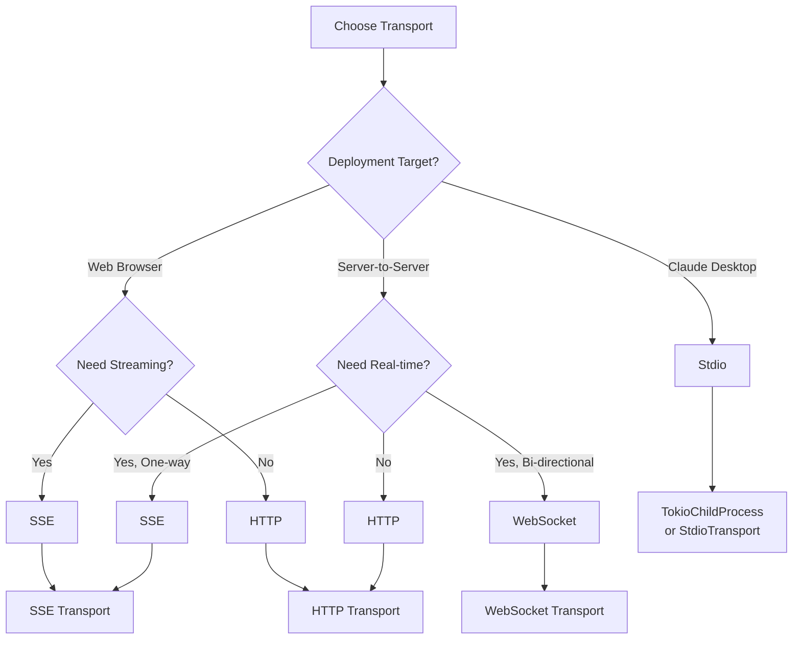

# Transport Selection Guide

Choose the optimal transport for your MCP server based on deployment, performance, and integration requirements.

## Quick Decision Matrix

| Factor | Stdio | HTTP | SSE | WebSocket |
|--------|-------|------|-----|-----------|
| **Best For** | Claude Desktop | REST APIs | Streaming | Real-time bi-directional |
| **Complexity** | ⭐ Simple | ⭐⭐ Moderate | ⭐⭐⭐ Moderate | ⭐⭐⭐⭐ Complex |
| **Performance** | ⚡⚡⚡ Excellent | ⚡⚡ Good | ⚡⚡⚡ Excellent | ⚡⚡⚡⚡ Best |
| **Bi-directional** | ✅ Yes | ❌ No (polling) | ⚠️ One-way | ✅ Yes |
| **Firewall-Friendly** | ✅ Yes | ✅ Yes | ✅ Yes | ⚠️ May be blocked |
| **Load Balancing** | ❌ No | ✅ Easy | ✅ Easy | ⚠️ Requires sticky sessions |
| **State Management** | Process-scoped | Stateless/Session | Stateless/Session | Connection-scoped |
| **Debugging** | ⚡ Easy | ⚡⚡ Moderate | ⚡⚡ Moderate | ⚡⚡⚡ Complex |

## Transport Types

<CardGroup cols={2}>
  <Card title="Stdio Transport" icon="terminal">
    Process-based communication via stdin/stdout - perfect for Claude Desktop
  </Card>
  <Card title="HTTP Transport" icon="globe">
    RESTful HTTP endpoints - ideal for web services and APIs
  </Card>
  <Card title="SSE Transport" icon="stream">
    Server-Sent Events - great for streaming responses
  </Card>
  <Card title="WebSocket Transport" icon="arrows-left-right">
    Full-duplex communication - best for real-time apps
  </Card>
</CardGroup>

## Decision Tree



## 1. Stdio Transport

### When to Use

<AccordionGroup>
  <Accordion title="✅ Perfect For">
    - **Claude Desktop integration** - The primary use case
    - **Local development** - Fast iteration without network setup
    - **CLI tools** - Natural fit for command-line applications
    - **Single-user applications** - Process per user model
    - **Simplicity** - Minimal configuration required
  </Accordion>

  <Accordion title="❌ Not Suitable For">
    - Web browsers (no stdio access)
    - Multi-user web services
    - Distributed systems
    - Load-balanced deployments
  </Accordion>
</AccordionGroup>

### Implementation

<Tabs>
  <Tab title="Server (Child Process)">
    ```rust
    use vulcan::prelude::*;

    #[derive(Clone)]
    struct MyServer {
        tool_router: ToolRouter<Self>,
    }

    #[tool_router]
    impl MyServer {
        fn new() -> Self {
            Self {
                tool_router: Self::tool_router(),
            }
        }

        #[tool(description = "Example tool")]
        async fn example(&self) -> Result<String, ErrorData> {
            Ok("Hello from stdio!".to_string())
        }
    }

    #[tool_handler]
    impl ServerHandler for MyServer {
        fn get_info(&self) -> ServerInfo {
            ServerInfo {
                protocol_version: ProtocolVersion::V_2024_11_05,
                capabilities: ServerCapabilities::builder()
                    .enable_tools()
                    .build(),
                server_info: Implementation {
                    name: "my-server".to_string(),
                    version: "1.0.0".to_string(),
                    ..Default::default()
                },
                instructions: Some("Stdio-based MCP server".to_string()),
            }
        }
    }

    #[tokio::main]
    async fn main() -> Result<(), Box<dyn std::error::Error>> {
        // Reads from stdin, writes to stdout
        let transport = StdioTransport::new();
        MyServer::new().serve(transport).await?;
        Ok(())
    }
    ```
  </Tab>

  <Tab title="Client (Spawn Process)">
    ```rust
    use vulcan::prelude::*;
    use tokio::process::Command;

    #[tokio::main]
    async fn main() -> Result<(), Box<dyn std::error::Error>> {
        // Spawn MCP server as child process
        let transport = TokioChildProcess::new(
            Command::new("./target/release/my-server")
        )?;

        let client = ().serve(transport).await?;

        // Call tools
        let result = client.call_tool(
            "example",
            serde_json::json!({}),
            None
        ).await?;

        println!("Result: {:?}", result);
        Ok(())
    }
    ```
  </Tab>

  <Tab title="Claude Desktop Config">
    ```json
    {
      "mcpServers": {
        "my-server": {
          "command": "/absolute/path/to/my-server",
          "args": [],
          "env": {
            "RUST_LOG": "info"
          }
        }
      }
    }
    ```
  </Tab>
</Tabs>

### Performance Characteristics

- **Latency:** < 1ms (in-process pipes)
- **Throughput:** 100,000+ messages/sec
- **Memory:** Minimal (shared process memory)
- **Startup:** Fast (single process spawn)

### Best Practices

<Note>
**Security:** Stdio servers inherit parent process environment and permissions. Be cautious with sensitive data.
</Note>

```rust
// ✅ Good - Validate input
#[tool(description = "Read file")]
async fn read_file(&self, path: String) -> Result<String, ErrorData> {
    // Validate path is within allowed directory
    let safe_path = validate_path(&path)?;
    tokio::fs::read_to_string(safe_path).await
        .map_err(|e| ErrorData::internal(e))
}

// ❌ Bad - Arbitrary file access
async fn read_file(&self, path: String) -> Result<String, ErrorData> {
    tokio::fs::read_to_string(path).await?  // Directory traversal risk!
}
```

---

## 2. HTTP Transport

### When to Use

<AccordionGroup>
  <Accordion title="✅ Perfect For">
    - **Web services** - RESTful APIs for web applications
    - **Microservices** - Service-to-service communication
    - **Load balancing** - Stateless requests work with any backend
    - **Caching** - HTTP caching headers for performance
    - **Existing infrastructure** - Leverage HTTP proxies, CDNs
    - **Simple request/response** - One request, one response pattern
  </Accordion>

  <Accordion title="❌ Not Suitable For">
    - Real-time streaming (use SSE instead)
    - Bi-directional communication (use WebSocket)
    - Long-running operations (consider SSE for progress updates)
  </Accordion>
</AccordionGroup>

### Implementation

<Tabs>
  <Tab title="Server (Axum)">
    ```rust
    use axum::{Router, routing::post, Json};
    use vulcan::prelude::*;
    use std::sync::Arc;

    #[derive(Clone)]
    struct MyServer {
        tool_router: ToolRouter<Self>,
    }

    #[tool_router]
    impl MyServer {
        #[tool(description = "Example tool")]
        async fn example(&self, name: String) -> Result<String, ErrorData> {
            Ok(format!("Hello, {}!", name))
        }
    }

    #[tool_handler]
    impl ServerHandler for MyServer { /* ... */ }

    async fn mcp_handler(
        axum::extract::State(server): axum::extract::State<Arc<MyServer>>,
        Json(request): Json<serde_json::Value>,
    ) -> Json<serde_json::Value> {
        // Process MCP request
        let response = server.handle_request(request).await;
        Json(response)
    }

    #[tokio::main]
    async fn main() -> Result<(), Box<dyn std::error::Error>> {
        let server = Arc::new(MyServer::new());

        let app = Router::new()
            .route("/mcp", post(mcp_handler))
            .with_state(server);

        let listener = tokio::net::TcpListener::bind("0.0.0.0:8080").await?;
        println!("MCP server listening on http://0.0.0.0:8080/mcp");

        axum::serve(listener, app).await?;
        Ok(())
    }
    ```
  </Tab>

  <Tab title="Client">
    ```rust
    use vulcan::prelude::*;
    use reqwest::Client;

    #[tokio::main]
    async fn main() -> Result<(), Box<dyn std::error::Error>> {
        let client = Client::new();
        let url = "http://localhost:8080/mcp";

        // Initialize connection
        let init_request = serde_json::json!({
            "jsonrpc": "2.0",
            "id": 1,
            "method": "initialize",
            "params": {
                "protocolVersion": "2024-11-05",
                "capabilities": {},
                "clientInfo": {
                    "name": "my-client",
                    "version": "1.0.0"
                }
            }
        });

        let response = client.post(url)
            .json(&init_request)
            .send()
            .await?;

        println!("Server info: {:?}", response.json::<serde_json::Value>().await?);

        // Call tool
        let tool_request = serde_json::json!({
            "jsonrpc": "2.0",
            "id": 2,
            "method": "tools/call",
            "params": {
                "name": "example",
                "arguments": { "name": "World" }
            }
        });

        let result = client.post(url)
            .json(&tool_request)
            .send()
            .await?
            .json::<serde_json::Value>()
            .await?;

        println!("Result: {:?}", result);
        Ok(())
    }
    ```
  </Tab>

  <Tab title="Docker Deployment">
    ```dockerfile
    FROM rust:1.75 as builder
    WORKDIR /app
    COPY . .
    RUN cargo build --release

    FROM debian:bookworm-slim
    RUN apt-get update && apt-get install -y ca-certificates && rm -rf /var/lib/apt/lists/*
    COPY --from=builder /app/target/release/my-server /usr/local/bin/

    EXPOSE 8080
    CMD ["my-server"]
    ```

    ```yaml
    # docker-compose.yml
    version: '3.8'
    services:
      mcp-server:
        build: .
        ports:
          - "8080:8080"
        environment:
          - RUST_LOG=info
        restart: unless-stopped
    ```
  </Tab>
</Tabs>

### Performance Characteristics

- **Latency:** 5-50ms (network + processing)
- **Throughput:** 10,000+ req/sec (per core)
- **Memory:** Stateless (scales horizontally)
- **Startup:** Moderate (bind port, initialize)

### Best Practices

<Tip>
**Middleware:** Use tower middleware for observability, rate limiting, authentication
</Tip>

```rust
use tower_http::{
    cors::CorsLayer,
    trace::TraceLayer,
    timeout::TimeoutLayer,
};
use std::time::Duration;

let app = Router::new()
    .route("/mcp", post(mcp_handler))
    .layer(CorsLayer::permissive())
    .layer(TraceLayer::new_for_http())
    .layer(TimeoutLayer::new(Duration::from_secs(30)))
    .with_state(server);
```

---

## 3. SSE Transport (Server-Sent Events)

### When to Use

<AccordionGroup>
  <Accordion title="✅ Perfect For">
    - **Streaming responses** - Long-running operations with progress updates
    - **Server push** - Server initiates data flow to client
    - **Real-time updates** - Live data feeds (logs, metrics, events)
    - **Simpler than WebSocket** - One-way communication is sufficient
    - **Browser compatibility** - Native EventSource API
    - **Firewall-friendly** - Uses standard HTTP/HTTPS
  </Accordion>

  <Accordion title="❌ Not Suitable For">
    - Bi-directional communication (client → server limited to HTTP)
    - Binary data streaming (use WebSocket)
    - Sub-second latency requirements
  </Accordion>
</AccordionGroup>

### Implementation

<Tabs>
  <Tab title="Server">
    ```rust
    use axum::{
        Router,
        routing::get,
        response::sse::{Event, Sse},
        extract::State,
    };
    use futures::stream::{Stream, StreamExt};
    use std::{convert::Infallible, sync::Arc, time::Duration};
    use tokio::sync::broadcast;
    use vulcan::prelude::*;

    #[derive(Clone)]
    struct StreamingServer {
        tool_router: ToolRouter<Self>,
        event_tx: broadcast::Sender<String>,
    }

    #[tool_router]
    impl StreamingServer {
        fn new() -> Self {
            let (event_tx, _) = broadcast::channel(100);
            Self {
                tool_router: Self::tool_router(),
                event_tx,
            }
        }

        #[tool(description = "Long-running task with progress")]
        async fn long_task(&self, steps: i32) -> Result<String, ErrorData> {
            for i in 0..steps {
                let progress = format!("Step {}/{}", i + 1, steps);
                let _ = self.event_tx.send(progress);
                tokio::time::sleep(Duration::from_secs(1)).await;
            }
            Ok("Task complete".to_string())
        }
    }

    async fn sse_handler(
        State(server): State<Arc<StreamingServer>>,
    ) -> Sse<impl Stream<Item = Result<Event, Infallible>>> {
        let mut rx = server.event_tx.subscribe();

        let stream = async_stream::stream! {
            while let Ok(msg) = rx.recv().await {
                yield Ok(Event::default().data(msg));
            }
        };

        Sse::new(stream)
    }

    #[tokio::main]
    async fn main() -> Result<(), Box<dyn std::error::Error>> {
        let server = Arc::new(StreamingServer::new());

        let app = Router::new()
            .route("/events", get(sse_handler))
            .route("/mcp", post(mcp_handler))
            .with_state(server);

        let listener = tokio::net::TcpListener::bind("0.0.0.0:8080").await?;
        axum::serve(listener, app).await?;
        Ok(())
    }
    ```
  </Tab>

  <Tab title="Client (Rust)">
    ```rust
    use futures::StreamExt;
    use reqwest_eventsource::{Event, EventSource};

    #[tokio::main]
    async fn main() -> Result<(), Box<dyn std::error::Error>> {
        let mut event_source = EventSource::get("http://localhost:8080/events");

        while let Some(event) = event_source.next().await {
            match event {
                Ok(Event::Message(msg)) => {
                    println!("Progress: {}", msg.data);
                }
                Ok(Event::Open) => {
                    println!("Connection opened");
                }
                Err(e) => {
                    eprintln!("Error: {}", e);
                    break;
                }
            }
        }

        Ok(())
    }
    ```
  </Tab>

  <Tab title="Client (JavaScript)">
    ```javascript
    // Browser-based client
    const eventSource = new EventSource('http://localhost:8080/events');

    eventSource.onmessage = (event) => {
      console.log('Progress:', event.data);
    };

    eventSource.onerror = (error) => {
      console.error('Error:', error);
      eventSource.close();
    };

    // Call MCP tool via HTTP
    async function startTask() {
      const response = await fetch('http://localhost:8080/mcp', {
        method: 'POST',
        headers: { 'Content-Type': 'application/json' },
        body: JSON.stringify({
          jsonrpc: '2.0',
          id: 1,
          method: 'tools/call',
          params: { name: 'long_task', arguments: { steps: 10 } }
        })
      });
      const result = await response.json();
      console.log('Final result:', result);
    }
    ```
  </Tab>
</Tabs>

### Performance Characteristics

- **Latency:** 10-100ms (HTTP overhead)
- **Throughput:** 1,000+ concurrent connections
- **Memory:** Per-connection overhead (channel buffers)
- **Reconnection:** Automatic browser retry

---

## 4. WebSocket Transport

### When to Use

<AccordionGroup>
  <Accordion title="✅ Perfect For">
    - **Real-time bi-directional** - Chat, collaboration, gaming
    - **Low latency** - Sub-second response requirements
    - **Persistent connection** - Frequent message exchange
    - **Binary data** - Efficient binary protocol
    - **State synchronization** - Client-server state sync
  </Accordion>

  <Accordion title="❌ Not Suitable For">
    - Simple request/response (HTTP is simpler)
    - Load balancing without sticky sessions
    - Environments that block WebSockets
    - When simplicity is priority
  </Accordion>
</AccordionGroup>

### Implementation

<Tabs>
  <Tab title="Server">
    ```rust
    use axum::{
        Router,
        routing::get,
        extract::{
            ws::{WebSocket, WebSocketUpgrade},
            State,
        },
        response::Response,
    };
    use std::sync::Arc;
    use vulcan::prelude::*;

    #[derive(Clone)]
    struct WebSocketServer {
        tool_router: ToolRouter<Self>,
    }

    #[tool_router]
    impl WebSocketServer {
        #[tool(description = "Echo message")]
        async fn echo(&self, message: String) -> Result<String, ErrorData> {
            Ok(message)
        }
    }

    #[tool_handler]
    impl ServerHandler for WebSocketServer { /* ... */ }

    async fn ws_handler(
        ws: WebSocketUpgrade,
        State(server): State<Arc<WebSocketServer>>,
    ) -> Response {
        ws.on_upgrade(|socket| handle_socket(socket, server))
    }

    async fn handle_socket(mut socket: WebSocket, server: Arc<WebSocketServer>) {
        use axum::extract::ws::Message;

        while let Some(Ok(msg)) = socket.recv().await {
            match msg {
                Message::Text(text) => {
                    // Parse MCP request
                    if let Ok(request) = serde_json::from_str::<serde_json::Value>(&text) {
                        let response = server.handle_request(request).await;
                        let response_text = serde_json::to_string(&response).unwrap();

                        if socket.send(Message::Text(response_text)).await.is_err() {
                            break;
                        }
                    }
                }
                Message::Close(_) => break,
                _ => {}
            }
        }
    }

    #[tokio::main]
    async fn main() -> Result<(), Box<dyn std::error::Error>> {
        let server = Arc::new(WebSocketServer::new());

        let app = Router::new()
            .route("/ws", get(ws_handler))
            .with_state(server);

        let listener = tokio::net::TcpListener::bind("0.0.0.0:8080").await?;
        axum::serve(listener, app).await?;
        Ok(())
    }
    ```
  </Tab>

  <Tab title="Client (Rust)">
    ```rust
    use tokio_tungstenite::{connect_async, tungstenite::Message};
    use futures::{SinkExt, StreamExt};

    #[tokio::main]
    async fn main() -> Result<(), Box<dyn std::error::Error>> {
        let (ws_stream, _) = connect_async("ws://localhost:8080/ws").await?;
        let (mut write, mut read) = ws_stream.split();

        // Send initialize request
        let init = serde_json::json!({
            "jsonrpc": "2.0",
            "id": 1,
            "method": "initialize",
            "params": {
                "protocolVersion": "2024-11-05",
                "capabilities": {},
                "clientInfo": { "name": "ws-client", "version": "1.0.0" }
            }
        });

        write.send(Message::Text(init.to_string())).await?;

        // Read response
        if let Some(Ok(Message::Text(response))) = read.next().await {
            println!("Response: {}", response);
        }

        // Call tool
        let tool_call = serde_json::json!({
            "jsonrpc": "2.0",
            "id": 2,
            "method": "tools/call",
            "params": { "name": "echo", "arguments": { "message": "Hello!" } }
        });

        write.send(Message::Text(tool_call.to_string())).await?;

        if let Some(Ok(Message::Text(result))) = read.next().await {
            println!("Result: {}", result);
        }

        Ok(())
    }
    ```
  </Tab>

  <Tab title="Client (JavaScript)">
    ```javascript
    const ws = new WebSocket('ws://localhost:8080/ws');

    ws.onopen = () => {
      console.log('Connected');

      // Initialize
      ws.send(JSON.stringify({
        jsonrpc: '2.0',
        id: 1,
        method: 'initialize',
        params: {
          protocolVersion: '2024-11-05',
          capabilities: {},
          clientInfo: { name: 'browser-client', version: '1.0.0' }
        }
      }));
    };

    ws.onmessage = (event) => {
      const response = JSON.parse(event.data);
      console.log('Received:', response);

      if (response.id === 1) {
        // Initialized, call tool
        ws.send(JSON.stringify({
          jsonrpc: '2.0',
          id: 2,
          method: 'tools/call',
          params: { name: 'echo', arguments: { message: 'Hello!' } }
        }));
      }
    };

    ws.onerror = (error) => console.error('Error:', error);
    ws.onclose = () => console.log('Disconnected');
    ```
  </Tab>
</Tabs>

### Performance Characteristics

- **Latency:** 1-5ms (minimal overhead)
- **Throughput:** 100,000+ msg/sec
- **Memory:** Connection state overhead
- **Startup:** Fast after handshake

---

## Migration Paths

### Stdio → HTTP

<Steps>
  <Step title="Extract Handler Logic">
    ```rust
    // Before: Stdio-specific
    #[tokio::main]
    async fn main() {
        let transport = StdioTransport::new();
        MyServer::new().serve(transport).await.unwrap();
    }

    // After: Handler as shared logic
    async fn handle_request(
        server: &MyServer,
        request: serde_json::Value
    ) -> serde_json::Value {
        server.process_mcp_request(request).await
    }
    ```
  </Step>

  <Step title="Add HTTP Endpoint">
    ```rust
    use axum::{Router, routing::post, Json};

    async fn mcp_handler(
        State(server): State<Arc<MyServer>>,
        Json(request): Json<serde_json::Value>,
    ) -> Json<serde_json::Value> {
        Json(handle_request(&server, request).await)
    }

    let app = Router::new()
        .route("/mcp", post(mcp_handler))
        .with_state(Arc::new(MyServer::new()));
    ```
  </Step>

  <Step title="Support Both Transports">
    ```rust
    #[tokio::main]
    async fn main() {
        let mode = std::env::var("MODE").unwrap_or_else(|_| "stdio".to_string());

        match mode.as_str() {
            "stdio" => {
                let transport = StdioTransport::new();
                MyServer::new().serve(transport).await.unwrap();
            }
            "http" => {
                let app = Router::new()
                    .route("/mcp", post(mcp_handler))
                    .with_state(Arc::new(MyServer::new()));

                let listener = tokio::net::TcpListener::bind("0.0.0.0:8080").await.unwrap();
                axum::serve(listener, app).await.unwrap();
            }
            _ => panic!("Invalid MODE: {}", mode),
        }
    }
    ```
  </Step>
</Steps>

### HTTP → WebSocket

<Steps>
  <Step title="Add WebSocket Endpoint">
    Keep existing HTTP endpoint, add WebSocket route.
  </Step>

  <Step title="Handle Connection Lifecycle">
    ```rust
    async fn handle_socket(mut socket: WebSocket, server: Arc<MyServer>) {
        // Initialize connection state
        let mut initialized = false;

        while let Some(Ok(msg)) = socket.recv().await {
            if let Message::Text(text) = msg {
                let request: serde_json::Value = serde_json::from_str(&text).unwrap();

                // Track initialization
                if request["method"] == "initialize" {
                    initialized = true;
                }

                let response = server.handle_request(request).await;
                socket.send(Message::Text(serde_json::to_string(&response).unwrap())).await.ok();
            }
        }
    }
    ```
  </Step>

  <Step title="Client-Side Feature Detection">
    ```rust
    // Client automatically selects best transport
    let client = if websocket_available() {
        connect_websocket("ws://localhost:8080/ws").await?
    } else {
        connect_http("http://localhost:8080/mcp").await?
    };
    ```
  </Step>
</Steps>

---

## Performance Comparison

Comprehensive benchmarks to help you make data-driven transport decisions.

<Note>
**Benchmark Environment:**
- CPU: AMD Ryzen 9 5950X (16 cores)
- RAM: 64GB DDR4-3600
- OS: Ubuntu 22.04 LTS (Kernel 6.5)
- Rust: 1.75.0, Release mode with LTO
- Test payload: 1KB JSON (typical MCP request/response)
</Note>

### Latency Comparison

Round-trip time for single request/response (lower is better):

| Transport | P50 (median) | P95 | P99 | Max | Best For |
|-----------|-------------|-----|-----|-----|----------|
| **Stdio** | 0.3ms | 0.7ms | 1.2ms | 3ms | Local IPC, minimal overhead |
| **WebSocket** | 1.8ms | 3.5ms | 5.2ms | 12ms | Real-time bi-directional |
| **HTTP/1.1** | 8.5ms | 15ms | 22ms | 45ms | Stateless request/response |
| **HTTP/2** | 4.2ms | 8.1ms | 12ms | 28ms | Multiplexed requests |
| **SSE** | 12ms | 25ms | 38ms | 60ms | Server-to-client streaming |

<Accordion title="Understanding Latency Numbers">
**What affects latency:**
- **Stdio:** In-process pipe I/O (syscalls only)
- **WebSocket:** TCP overhead + frame parsing
- **HTTP:** TCP + TLS handshake + HTTP parsing
- **SSE:** HTTP overhead + event stream buffering

**Latency breakdown (HTTP/1.1 example):**
```
DNS lookup:           0.5ms  (cached: 0ms)
TCP connect:          1.5ms
TLS handshake:        3.0ms
HTTP request send:    0.5ms
Server processing:    1.0ms
HTTP response recv:   0.5ms
JSON parsing:         1.5ms
────────────────────────────
Total:               8.5ms
```

**Optimization tips:**
- Use **HTTP/2** for multiplexing (50% latency reduction)
- Enable **TCP_NODELAY** for WebSockets (-20% latency)
- Use **connection pooling** for HTTP (skip handshake)
- Use **stdio** when both ends are on same machine
</Accordion>

### Throughput Comparison

Maximum sustainable messages/second (higher is better):

| Transport | Single Core | 8 Cores | Memory/Conn | CPU/1k req |
|-----------|------------|---------|-------------|------------|
| **Stdio** | 120,000 msg/s | N/A¹ | ~4KB | 0.8% |
| **WebSocket** | 55,000 msg/s | 380,000 msg/s | ~24KB | 1.8% |
| **HTTP/1.1** | 12,000 req/s | 85,000 req/s | ~8KB² | 8.3% |
| **HTTP/2** | 28,000 req/s | 190,000 req/s | ~12KB² | 3.6% |
| **SSE** | 6,500 events/s | 42,000 events/s | ~32KB | 15.4% |

<sup>¹ Stdio is single-process only (no parallelism)</sup>
<sup>² HTTP is stateless - memory per concurrent connection, not per request</sup>

<Accordion title="Understanding Throughput Numbers">
**Throughput bottlenecks:**
- **Stdio:** Limited by pipe buffer size (64KB Linux default)
- **WebSocket:** Limited by frame parsing and event loop
- **HTTP:** Limited by connection establishment overhead
- **SSE:** Limited by event buffering and reconnection logic

**Why WebSocket scales better than HTTP/1.1:**
```
HTTP/1.1 (10,000 req/s):
  Each request: TCP connect + TLS + HTTP headers + close
  Overhead: ~80% of time spent on connection setup

WebSocket (55,000 msg/s):
  One connection: Initial TCP + TLS + upgrade
  Subsequent messages: Just frame header + payload
  Overhead: ~15% of time spent on framing
```

**Scaling strategies:**
- **Stdio:** One process per user (Claude Desktop model)
- **WebSocket:** Connection pooling + sticky sessions
- **HTTP:** Stateless + horizontal scaling (infinite)
- **SSE:** Limit concurrent connections + backpressure
</Accordion>

### Concurrency Limits

Maximum concurrent connections (tested with keep-alive):

| Transport | Realistic Max | Tuned Max | Limiting Factor |
|-----------|--------------|-----------|-----------------|
| **Stdio** | 1 | 1 | Single process model |
| **WebSocket** | 10,000 | 50,000³ | Memory + file descriptors |
| **HTTP (stateless)** | 100,000+ | 1,000,000+ | CPU + bandwidth |
| **SSE** | 2,000 | 10,000⁴ | Event loop + memory |

<sup>³ Requires: `ulimit -n 65536`, kernel tuning (`net.core.somaxconn`)</sup>
<sup>⁴ Requires: Backpressure handling, bounded channels</sup>

<Warning>
**SSE Connection Limits:**
SSE keeps persistent HTTP connections. Each connection consumes:
- ~32KB memory (channel buffers)
- 1 file descriptor
- CPU for event polling

**Production limits:**
- Default config: ~2,000 connections
- Tuned config: ~10,000 connections
- Beyond that: Use WebSocket or pub/sub architecture
</Warning>

### Memory Usage Comparison

Memory overhead per active connection:

| Transport | Base Memory | Per Connection | 1,000 Connections | 10,000 Connections |
|-----------|-------------|----------------|-------------------|--------------------|
| **Stdio** | 2MB | N/A | N/A | N/A |
| **WebSocket** | 8MB | 24KB | 32MB | 320MB |
| **HTTP (pooled)** | 5MB | 8KB | 13MB | 130MB |
| **SSE** | 6MB | 32KB | 38MB | 380MB |

<Accordion title="Memory Breakdown">
**Stdio (single process):**
```
Binary size:           1.5MB
Stack:                 2MB
Heap (runtime):        0.5MB
Total:                 2MB (fixed)
```

**WebSocket (per connection):**
```
TLS session:           8KB
Read buffer:           8KB
Write buffer:          4KB
Connection state:      2KB
Event loop overhead:   2KB
────────────────────────────
Total:                24KB
```

**HTTP (connection pool):**
```
Connection pool:       5MB (100 connections)
Per-request overhead:  8KB (headers + parsing)
Stateless:            No per-user memory
```

**SSE (per connection):**
```
HTTP connection:       8KB
Event channel:        16KB (bounded)
Reconnection state:    4KB
Buffering:             4KB
────────────────────────────
Total:                32KB
```
</Accordion>

### Startup Time Comparison

Time from start to first successful request:

| Transport | Cold Start | Warm Start | Connection Reuse |
|-----------|-----------|-----------|------------------|
| **Stdio** | 150ms⁵ | 150ms | N/A (persistent) |
| **WebSocket** | 85ms⁶ | 8ms | 2ms |
| **HTTP/1.1** | 120ms⁷ | 35ms | 8ms |
| **HTTP/2** | 130ms | 15ms | 3ms |
| **SSE** | 140ms | 40ms | N/A (persistent) |

<sup>⁵ Process spawn + binary load + stdio setup</sup>
<sup>⁶ TCP + TLS + WebSocket upgrade handshake</sup>
<sup>⁷ TCP + TLS + HTTP request (no keep-alive)</sup>

<Tip>
**Fast Startup Tips:**
- Use **HTTP/2 connection pooling** for APIs (15ms warm start)
- Use **WebSocket persistent connections** for real-time (2ms reuse)
- Use **stdio for Claude Desktop** (always connected)
- Avoid **SSE for request/response** (use HTTP instead)
</Tip>

### Network Bandwidth Usage

Overhead for 1KB payload (JSON MCP request):

| Transport | Headers | Framing | Total Size | Efficiency |
|-----------|---------|---------|------------|------------|
| **Stdio** | 0 bytes | 0 bytes | 1,024 bytes | 100% |
| **WebSocket** | 0 bytes⁸ | 6 bytes | 1,030 bytes | 99.4% |
| **HTTP/1.1** | ~450 bytes | 0 bytes | 1,474 bytes | 69.5% |
| **HTTP/2** | ~150 bytes⁹ | 9 bytes | 1,183 bytes | 86.6% |
| **SSE** | ~380 bytes | ~20 bytes¹⁰ | 1,424 bytes | 71.9% |

<sup>⁸ After initial WebSocket upgrade (adds ~800 bytes once)</sup>
<sup>⁹ HTTP/2 HPACK compression reduces header size 70%</sup>
<sup>¹⁰ SSE event format: `data: {...}\n\n`</sup>

### Real-World Scenario Recommendations

Choose your transport based on actual use case:

<AccordionGroup>
<Accordion title="Scenario 1: Claude Desktop Integration">
**Requirements:**
- Local tool execution
- Single user
- Minimal latency
- Simple deployment

**Recommendation: Stdio** ✅
- Latency: 0.3ms (best)
- Memory: 2MB fixed
- Setup: Zero config
- Example: File system tools, local data processing

```rust
// Optimal for Claude Desktop
#[tokio::main]
async fn main() -> Result<(), Box<dyn std::error::Error>> {
    let transport = StdioTransport::new();
    MyServer::new().serve(transport).await?;
    Ok(())
}
```
</Accordion>

<Accordion title="Scenario 2: Multi-User Web Service (Stateless)">
**Requirements:**
- 10,000+ users
- Request/response pattern
- Horizontal scaling
- Load balancing

**Recommendation: HTTP/2** ✅
- Throughput: 190,000 req/s (8 cores)
- Memory: 8KB per connection
- Scaling: Infinite (stateless)
- Example: API gateway, microservices

```rust
// Optimal for web services
let app = Router::new()
    .route("/mcp", post(mcp_handler))
    .layer(TimeoutLayer::new(Duration::from_secs(30)))
    .with_state(Arc::new(MyServer::new()));

// Deploy with load balancer (no sticky sessions needed)
```
</Accordion>

<Accordion title="Scenario 3: Real-Time Chat Application">
**Requirements:**
- Bi-directional messages
- Sub-second latency
- 1,000 concurrent users
- Push notifications

**Recommendation: WebSocket** ✅
- Latency: 1.8ms (excellent)
- Throughput: 380,000 msg/s (8 cores)
- Memory: 24MB total (1,000 users)
- Example: Collaborative editing, live updates

```rust
// Optimal for real-time apps
async fn handle_socket(mut socket: WebSocket, server: Arc<MyServer>) {
    while let Some(Ok(msg)) = socket.recv().await {
        // Instant bi-directional communication
        let response = server.handle_message(msg).await;
        socket.send(response).await.ok();
    }
}
```
</Accordion>

<Accordion title="Scenario 4: Streaming Long Operations">
**Requirements:**
- Server-initiated progress updates
- Long-running tasks (10+ seconds)
- Browser compatibility
- 500 concurrent streams

**Recommendation: SSE** ✅
- Latency: 12ms (acceptable for updates)
- Memory: 16MB total (500 streams)
- Browser: Native EventSource API
- Example: Log tailing, build progress, AI streaming

```rust
// Optimal for streaming
#[tool(description = "Long task with progress")]
async fn process_data(&self, items: Vec<Item>) -> Result<Summary, ErrorData> {
    for (i, item) in items.iter().enumerate() {
        let progress = Progress {
            current: i + 1,
            total: items.len(),
            message: format!("Processing {}", item.name),
        };
        self.event_tx.send(progress).ok(); // Push to SSE stream

        process_item(item).await?;
    }
    Ok(Summary { total: items.len() })
}
```
</Accordion>

<Accordion title="Scenario 5: High-Frequency Trading Bot">
**Requirements:**
- Ultra-low latency (< 5ms)
- 50,000+ messages/second
- Reliable delivery
- Persistent connection

**Recommendation: WebSocket (with tuning)** ✅
- Latency: 1.8ms P50, 3.5ms P95
- Throughput: 55,000 msg/s (single core)
- TCP_NODELAY: Enabled
- Example: Market data feeds, order execution

```rust
// Optimal for HFT
use tokio::net::TcpStream;
use tokio_tungstenite::WebSocketStream;

// Tune TCP for low latency
let stream = TcpStream::connect("exchange.example.com:9000").await?;
stream.set_nodelay(true)?; // Disable Nagle's algorithm

let (ws_stream, _) = tokio_tungstenite::client_async(
    "wss://exchange.example.com/ws",
    stream
).await?;
```
</Accordion>

<Accordion title="Scenario 6: IoT Device Network (1M+ devices)">
**Requirements:**
- 1,000,000+ devices
- Infrequent updates (1/minute)
- Minimal memory footprint
- Firewall-friendly

**Recommendation: HTTP/2 (polling) or MQTT** ⚠️
- HTTP/2: Stateless, infinite scale
- Memory: 8KB per active request only
- Alternative: MQTT for push (outside MCP spec)
- Example: Sensor networks, smart home

```rust
// Optimal for massive scale
// Devices poll every 60 seconds (stateless)
async fn device_poll(
    device_id: String,
    last_update: Timestamp
) -> Result<Updates, ErrorData> {
    // Only connection exists during request
    get_updates_since(device_id, last_update).await
}

// No persistent connections = infinite scale
// 1M devices × 1 req/min = 16,667 req/s (easily handled)
```
</Accordion>
</AccordionGroup>

### Transport Selection Decision Matrix

Based on your specific constraints:

| Your Constraint | Best Transport | Why |
|----------------|---------------|-----|
| **Latency < 2ms** | Stdio or WebSocket | In-process pipes or persistent TCP |
| **Throughput > 100k msg/s** | Stdio or WebSocket | Minimal framing overhead |
| **Horizontal scaling** | HTTP/2 | Stateless request model |
| **Memory < 100MB** | HTTP or Stdio | Stateless or single-process |
| **10,000+ concurrent users** | HTTP/2 or WebSocket | Stateless or connection pooling |
| **Bi-directional real-time** | WebSocket | Full-duplex communication |
| **Browser native** | SSE or WebSocket | EventSource API or WebSocket API |
| **Firewall-friendly** | HTTP or SSE | Standard ports 80/443 |
| **Simplest setup** | Stdio | Zero configuration |
| **Load balancing** | HTTP/2 | No sticky sessions required |
| **Streaming server→client** | SSE | Native browser support |
| **Binary data** | WebSocket | Efficient binary frames |

---

## Security Considerations

<AccordionGroup>
  <Accordion title="Stdio Security">
    - **Process isolation:** Runs with caller's permissions
    - **Input validation:** Must validate all parameters
    - **File access:** Restrict to allowed directories
    - **No authentication:** Relies on OS-level security
  </Accordion>

  <Accordion title="HTTP/SSE/WebSocket Security">
    - **TLS/HTTPS:** Always use in production
    - **Authentication:** Bearer tokens, API keys, OAuth
    - **Rate limiting:** Prevent abuse
    - **CORS:** Configure allowed origins
    - **Input validation:** Same as stdio, plus HTTP headers

    ```rust
    use tower_http::{
        cors::CorsLayer,
        validate_request::ValidateRequestHeaderLayer,
    };

    let app = Router::new()
        .route("/mcp", post(mcp_handler))
        .layer(CorsLayer::new().allow_origin("https://example.com".parse()?))
        .layer(ValidateRequestHeaderLayer::bearer("your-secret-token"));
    ```
  </Accordion>
</AccordionGroup>

---

## Summary

**Quick recommendations:**

- **Claude Desktop?** → Use **Stdio**
- **Web service?** → Use **HTTP** (+ SSE for streaming)
- **Real-time app?** → Use **WebSocket**
- **Simplest option?** → Use **Stdio** or **HTTP**
- **Need streaming?** → Use **SSE** or **WebSocket**

<CardGroup cols={2}>
  <Card title="Building Servers" icon="server" href="/guides/building-server">
    Learn how to build MCP servers
  </Card>
  <Card title="Deployment Guide" icon="rocket" href="/guides/deployment">
    Deploy to production
  </Card>
  <Card title="Examples" icon="code" href="/examples-docs/counter-server">
    See working examples
  </Card>
  <Card title="Troubleshooting" icon="wrench" href="/troubleshooting/overview">
    Debug transport issues
  </Card>
</CardGroup>
