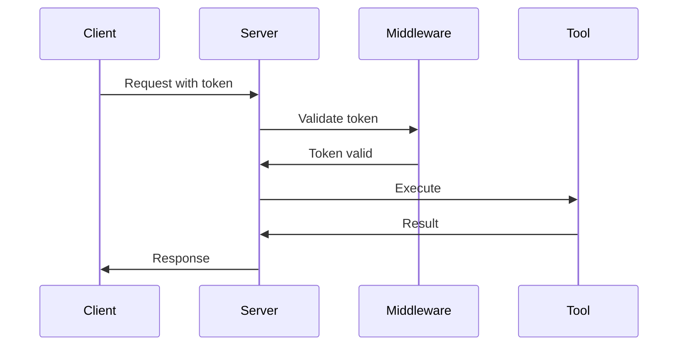

# OAuth Example

Add OAuth 2.0 authentication to your Vulcan MCP server for secure tool access.

## Quick Example

```rust
use vulcan::adapters::AuthenticationMiddleware;

// Add bearer token authentication
let mut chain = MiddlewareChain::new();
chain.add(Arc::new(
    AuthenticationMiddleware::bearer_token("your-secret-token")
));

server.serve_with_middleware(transport, chain).await?;
```

## OAuth Flow



## Complete OAuth Server

```rust
use vulcan::{
    adapters::AuthenticationMiddleware,
    ports::MiddlewareChain,
    ServerHandler,
};

#[tokio::main]
async fn main() -> Result<(), Box<dyn std::error::Error>> {
    // OAuth configuration
    let oauth_token = std::env::var("OAUTH_TOKEN")
        .expect("OAUTH_TOKEN must be set");

    // Create middleware chain with auth
    let mut chain = MiddlewareChain::new();
    chain.add(Arc::new(
        AuthenticationMiddleware::bearer_token(oauth_token)
    ));

    // Serve with authentication
    MyServer::new()
        .serve_with_middleware(transport, chain)
        .await?;

    Ok(())
}
```

## Custom OAuth Middleware

For advanced OAuth flows:

```rust
pub struct OAuthMiddleware {
    client_id: String,
    client_secret: String,
}

#[async_trait]
impl Middleware for OAuthMiddleware {
    async fn before_execute(
        &self,
        tool: &Tool,
        params: &serde_json::Value,
        context: &mut MiddlewareContext,
    ) -> Result<(), ErrorData> {
        // Extract token from params
        let token = params.get("access_token")
            .and_then(|v| v.as_str())
            .ok_or(ErrorData::invalid_input("Missing access_token"))?;

        // Validate token
        self.validate_token(token).await?;

        Ok(())
    }

    // ... other methods
}

impl OAuthMiddleware {
    async fn validate_token(&self, token: &str) -> Result<(), ErrorData> {
        // Call OAuth provider to validate
        let response = reqwest::Client::new()
            .post("https://oauth.provider.com/validate")
            .bearer_auth(token)
            .send()
            .await?;

        if !response.status().is_success() {
            return Err(ErrorData::invalid_input("Invalid token"));
        }

        Ok(())
    }
}
```

## Next Steps

<CardGroup cols={2}>
  <Card title="Middleware Guide" icon="layer-group" href="/examples-docs/middleware">
    Learn more about middleware
  </Card>
  <Card title="Deployment" icon="rocket" href="/guides/deployment">
    Deploy with OAuth
  </Card>
</CardGroup>
